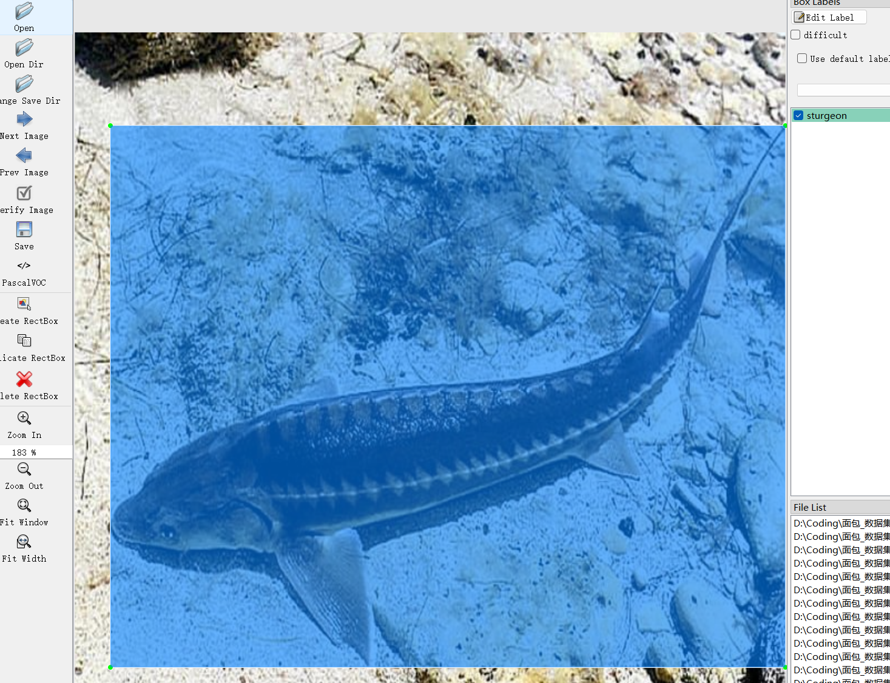

# Fish Detection - Target Detection Dataset

Dataset Information Introduction: There are a total of 4,357 images along with one-to-one corresponding annotation files.
Annotation files come in two formats: VOC formatted xml files and YOLO formatted txt files.
The objects annotated include the following:
['ide', 'sturgeon', 'sazan', 'lamprey', 'goby', 'catfish', 'acerina', 'escox', 'thymallus', 'perca','GrassCarp', 'SilverCarp']
The number of bounding box information is as follows: (When annotating, it's generally labeled in English, and the Chinese names provided inside the brackets are for reference)
Note: An image may contain multiple objects, so the total number of bounding boxes might be greater than the number of images.
The complete dataset includes three folders and one txt file:
all_images: Stores the dataset's images, screenshots included:
Image size information:
all_txt folder and classes.txt: Stores the YOLO formatted txt annotation files, in the same quantity as the images, each annotation file corresponds to one image.
classes.txt:
For a detailed understanding of the YOLO format standard file, please search for it on your own. In short, the number 0 represents the name at the array 0th position in classes.txt.
all_xml: VOC formatted xml annotation files.
In the same quantity as the images, each annotation file corresponds to one image.
For a detailed understanding of the VOC format standard file, please search for it on your own.
Both formats of annotation can be used, choose either one accordingly.
Annotation effect screenshots:

## Images

Here is a pay link on Stripe ( https://buy.stripe.com/3cs8yP7sY87d0vu9AB ). Please contact me lonlonago@foxmail.com after funding $89, and I will send you a complete data files , thank you!

